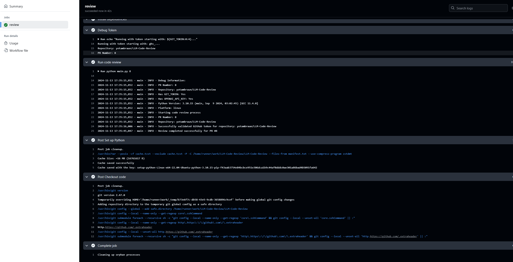
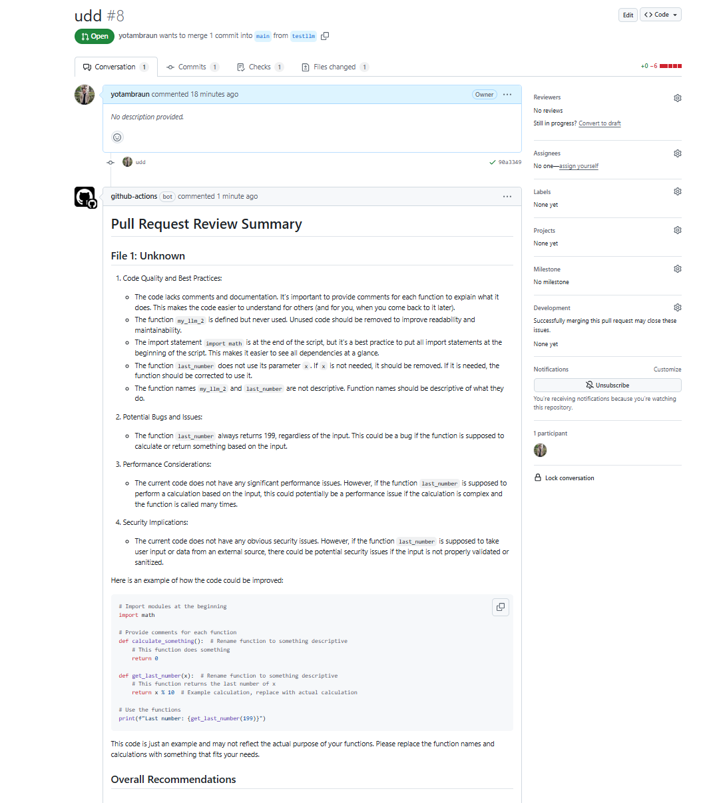

# LLM-Code-Review 🤖

> Transform your code review process with AI-powered insights



LLM-Code-Review revolutionizes your pull request workflow by providing intelligent, automated code reviews using GPT-4. Get instant feedback on code quality, security, and best practices.

## 🎯 Key Features

- 🔄 Automatic PR review triggering
- 🧠 Deep code analysis with GPT-4
- 📊 Comprehensive feedback
- ⚡ Performance insights
- 🛡️ Security scanning

## 📸 In Action

### Automated Review Summary


### Detailed Recommendations


## 🚀 Quick Setup

### 1. Configure GitHub Actions
Add these secrets to your repository:
- Go to `Settings` → `Secrets and variables` → `Actions`
- Add `OPENAI_API_KEY` with your OpenAI API key

### 2. Enable Workflow
Create `.github/workflows/code_review.yml` in your repository with the required configuration for automated reviews.

### 3. Test It Out
1. Create a new pull request
2. Watch the automated review process in action
3. Review the detailed feedback and recommendations

## ⚙️ Configuration

Customize the review focus in `src/config/settings.py`:
```python
@dataclass
class ReviewSettings:
    categories: List[str] = ('security', 'performance', 'style', 'conventions')
    max_file_size_kb: int = 500
    excluded_patterns: List[str] = ('*.pyc', '*.env', '__pycache__/*', '*.log')
```

## 🔧 Troubleshooting

Common issues and fixes:

1. **Reviews not triggering?**
   - Check Actions permissions
   - Verify OPENAI_API_KEY is set
   - Ensure workflow is enabled

2. **Authentication errors?**
   - Review repository permissions
   - Check token configuration
   - Verify API key validity

## 📖 Best Practices

1. **Optimal PR Size**
   - Keep changes focused
   - Submit smaller PRs
   - Clear descriptions

2. **Review Process**
   - Review AI suggestions
   - Test recommended changes
   - Address all categories